

# 🚀 DevStack Hub

### Production-Inspired Full Stack Application Deployed on AWS

A cloud-native full stack application demonstrating a production-inspired deployment using Docker, Amazon EC2, Application Load Balancer, Amazon RDS, Amazon EFS, and Auto Scaling Group.

---

# 📸 Application Preview

  

<b>Production deployment running on AWS infrastructure.</b>

---

# 📚 Table of Contents

- Overview
- Key Features
- Technology Stack
- System Architecture
- AWS Infrastructure
- Docker Deployment
- Deployment Guide
- Infrastructure Gallery

---

# 📖 Overview

**DevStack Hub** is a production-inspired cloud deployment project that demonstrates how a modern full stack application can be deployed on **Amazon Web Services (AWS)** using Docker containers.

The application consists of a **React + Vite frontend**, a **FastAPI backend**, and a **MySQL database hosted on Amazon RDS**. Both frontend and backend run inside Docker containers managed by Docker Compose on Amazon EC2 instances.

To improve availability and scalability, the application is deployed behind an **Application Load Balancer (ALB)** and supported by an **Auto Scaling Group (ASG)**. **Amazon EFS** provides shared storage across EC2 instances, while **Amazon RDS** stores persistent application data.

> **Note**
>
> The AWS infrastructure has been terminated after successful deployment to avoid unnecessary cloud costs. All screenshots included in this repository were captured from the live deployment and serve as proof of implementation.

---

# ✨ Key Features

- 🚀 Production-inspired AWS deployment
- 🐳 Dockerized frontend and backend
- ⚖️ Application Load Balancer (ALB)
- 📈 Auto Scaling Group (ASG)
- 🖥️ Amazon EC2
- 🗄️ Amazon RDS (MySQL)
- 📁 Amazon EFS
- 🌐 Nginx Reverse Proxy
- ⚡ FastAPI REST API
- 🎨 React + Vite Frontend
- 📦 Docker Compose
- 🔒 AWS Security Groups
- 📷 Real deployment screenshots

---

# 🛠️ Technology Stack

| Category | Technology |
|-----------|------------|
| Frontend | React + Vite |
| Backend | FastAPI |
| Web Server | Nginx |
| Database | Amazon RDS (MySQL) |
| Containerization | Docker |
| Orchestration | Docker Compose |
| Compute | Amazon EC2 |
| Load Balancing | AWS Application Load Balancer |
| Shared Storage | Amazon EFS |
| Scaling | AWS Auto Scaling Group |
| Cloud Platform | Amazon Web Services |

---

# 🏗️ System Architecture

  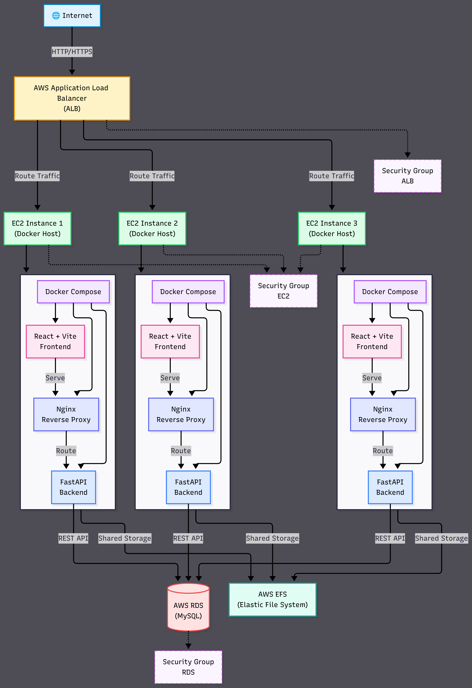

<b>Figure 1:</b> High-level AWS deployment architecture of DevStack Hub.

### Architecture Overview

The application follows a production-inspired AWS architecture where user requests are received by an **Application Load Balancer**, which distributes traffic across healthy **Amazon EC2 instances**.

Each EC2 instance runs **Docker Compose**, hosting both the **React + Vite frontend** and the **FastAPI backend**. The backend communicates with **Amazon RDS (MySQL)** for persistent data storage, while **Amazon EFS** provides shared storage that can be accessed by all EC2 instances.

This architecture separates compute, storage, networking, and database layers, making the deployment easier to manage, maintain, and scale.

---

# ☁️ AWS Infrastructure

The application is deployed on AWS using a highly available and scalable architecture. Every AWS service has a specific responsibility, working together to deliver the application reliably.

---

## 🚪 Application Load Balancer (ALB)

The Application Load Balancer acts as the public entry point of the application. Users access the website using the ALB DNS name. It distributes incoming HTTP traffic only to healthy EC2 instances.

  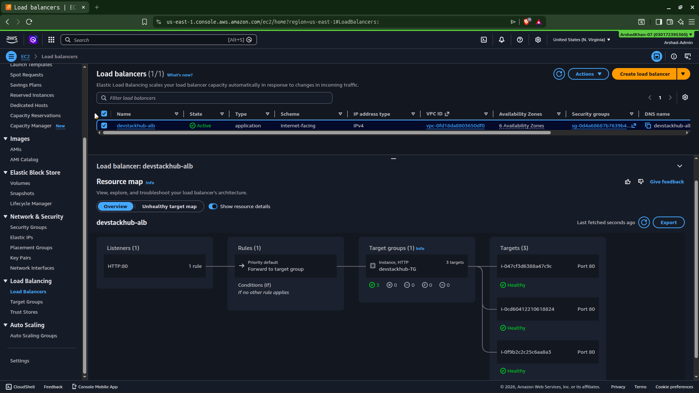

### Responsibilities

- Public entry point
- Routes HTTP requests
- Performs health checks
- Improves availability
- Works with Target Groups

---

## 🎯 Target Group

The Target Group continuously monitors EC2 instance health. Only healthy instances receive traffic from the Application Load Balancer.

  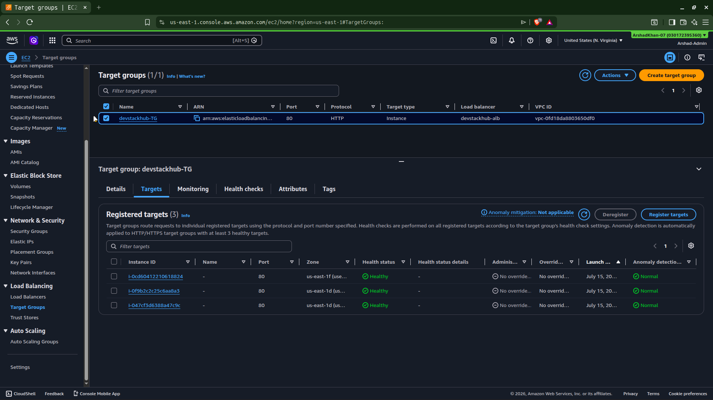

### Responsibilities

- Registers EC2 instances
- Performs health checks
- Removes unhealthy instances
- Sends traffic only to healthy targets

---

## 📈 Auto Scaling Group (ASG)

The Auto Scaling Group automatically maintains the desired number of EC2 instances. If an instance becomes unhealthy, it is replaced automatically to keep the application available.

  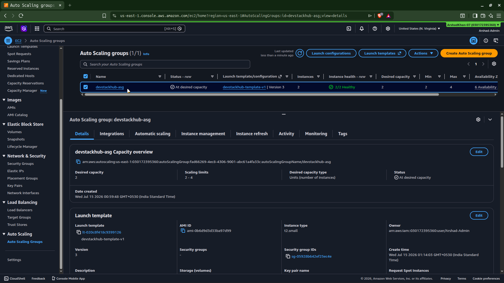

### Responsibilities

- Maintains desired capacity
- Replaces unhealthy EC2 instances
- Supports high availability
- Enables future scalability

---

## 🖥️ Amazon EC2

Amazon EC2 instances provide the compute layer of the application. Docker Compose runs the frontend and backend containers on each instance.

  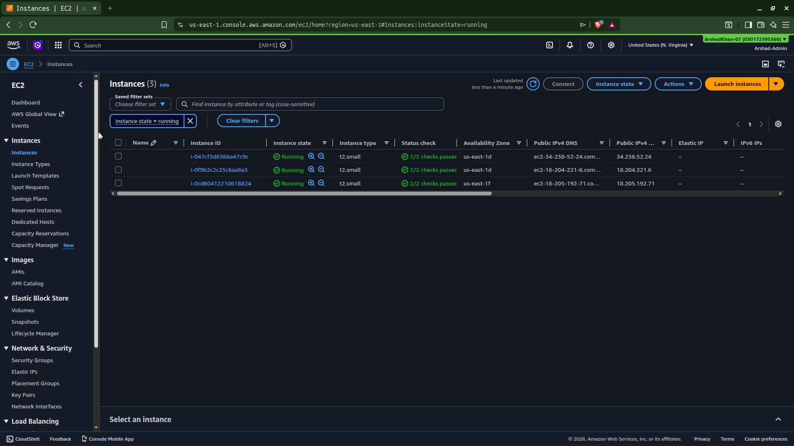

### Responsibilities

- Hosts Docker containers
- Runs React frontend
- Runs FastAPI backend
- Connects to Amazon RDS
- Mounts Amazon EFS

---

## 🐳 Docker Compose

Docker Compose starts and manages the complete application stack on the EC2 instance using a single configuration file.

  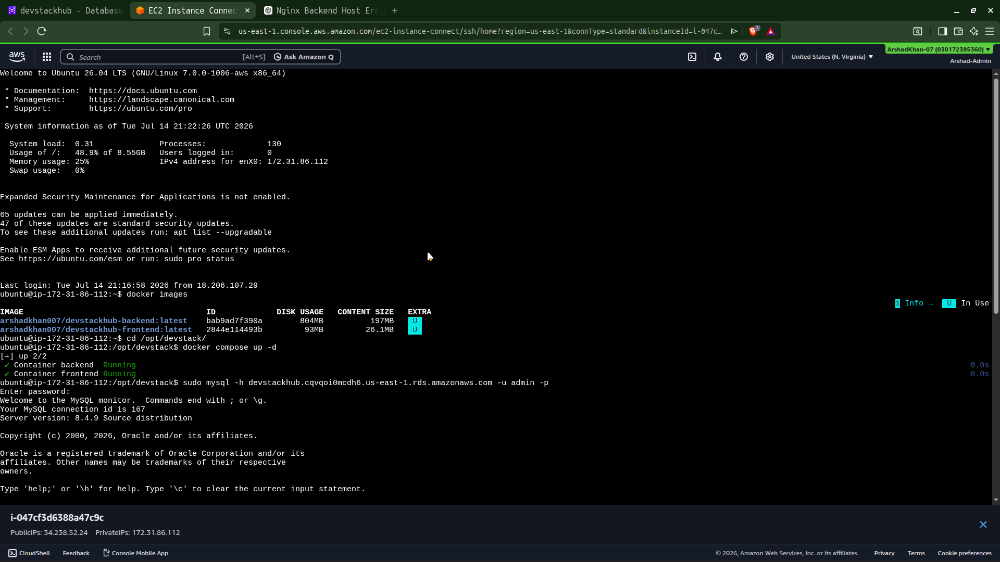

### Responsibilities

- Starts multiple containers
- Creates application network
- Loads environment variables
- Manages container lifecycle

---

## 🛡️ Security Groups

Security Groups act as virtual firewalls that control inbound and outbound traffic between AWS resources.

  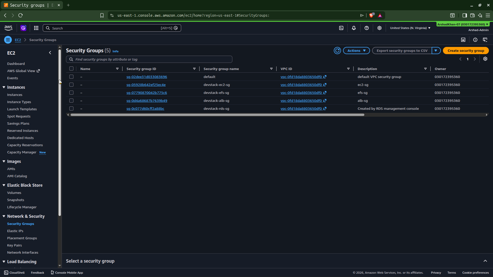

### Responsibilities

- Controls network access
- Allows only required ports
- Protects EC2, RDS and EFS
- Restricts unauthorized traffic

---

## 🗄️ Amazon RDS (MySQL)

Amazon RDS stores all persistent application data, including user information and login credentials.

  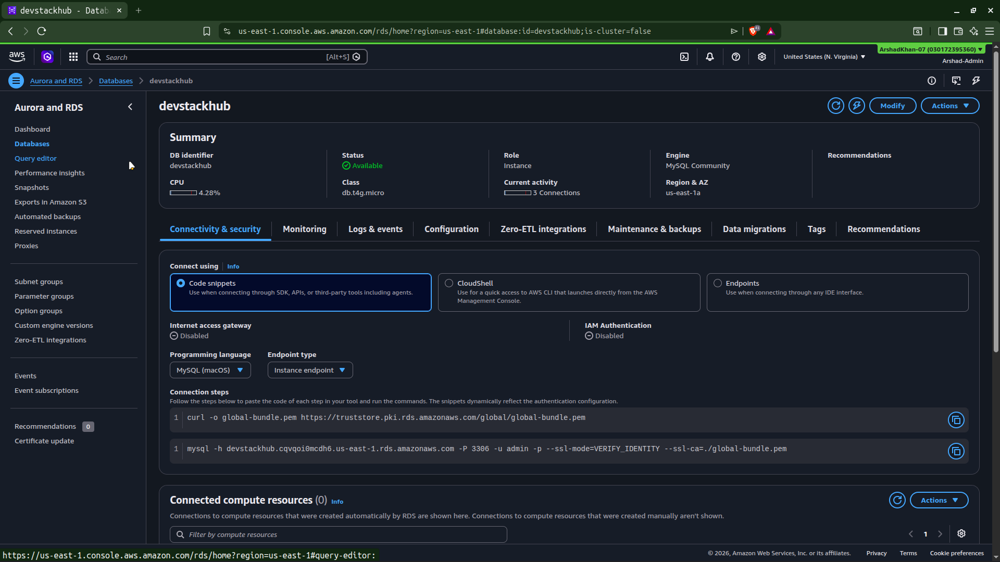

### Responsibilities

- Managed MySQL database
- Persistent storage
- Automatic backups
- Secure database connectivity

---

## 💾 Database Verification

The following screenshot shows the application data successfully stored inside the MySQL database.

  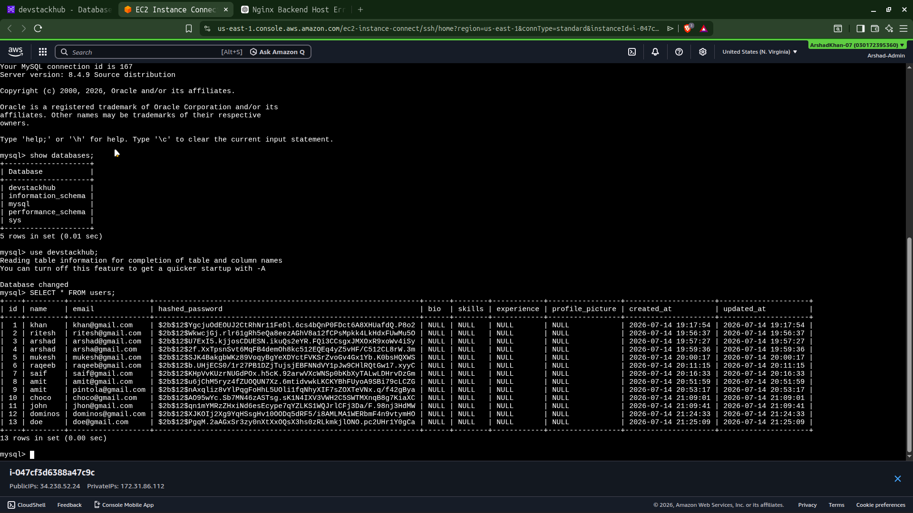

---

## 📂 Amazon EFS

Amazon Elastic File System provides shared storage that can be mounted by EC2 instances.

  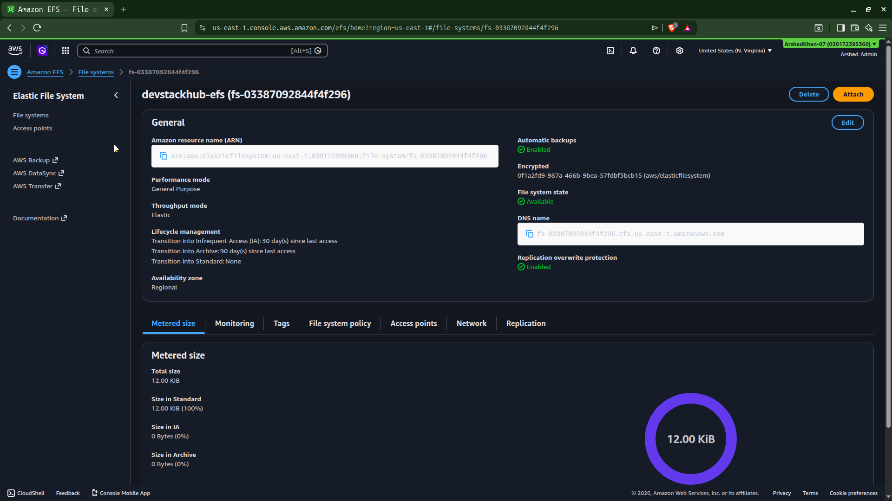

### Responsibilities

- Shared storage
- Persistent files
- Accessible by multiple EC2 instances
- Durable and scalable

---

## ✅ EFS Mounted Successfully

The screenshot below confirms that the Amazon EFS file system is successfully mounted on the EC2 instance.

  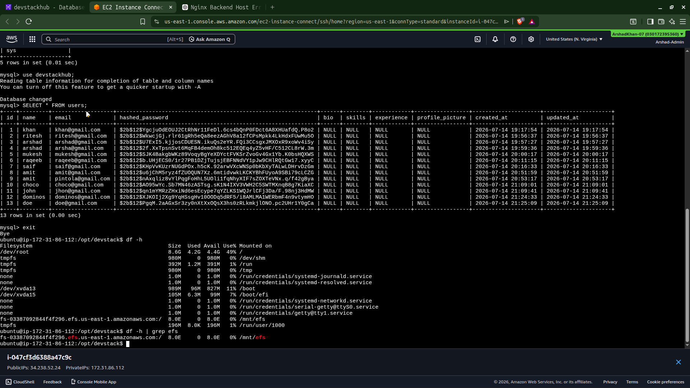

---

## 🔐 Login Page

The application is successfully deployed and accessible through the Application Load Balancer DNS.

  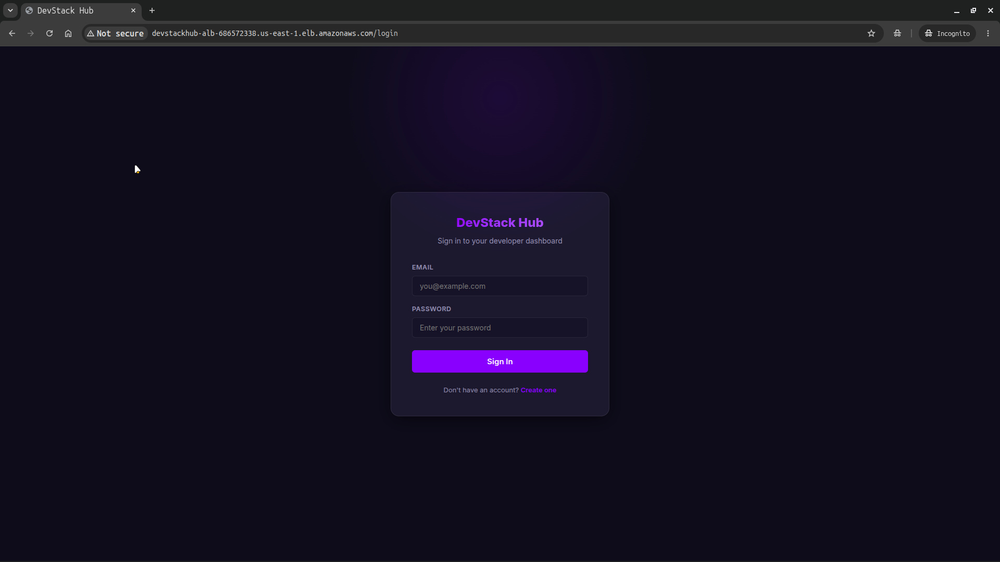

---

---

# 📌 Project Status

> **This repository represents a successfully completed cloud deployment project.**

The application was successfully deployed on AWS using **Amazon EC2, Application Load Balancer (ALB), Auto Scaling Group (ASG), Amazon RDS, Amazon EFS, Docker, and Docker Compose**. Every infrastructure component was provisioned, configured, tested, and validated before being documented.

To provide verifiable evidence of the deployment, screenshots from the live AWS environment have been included throughout this repository.

After successful testing and validation, the AWS infrastructure was intentionally decommissioned to prevent unnecessary cloud charges from continuously running resources.

> **Deployment Status:** ✅ Successfully Completed & Verified  
> **Current Infrastructure Status:** 🗑️ Decommissioned (Cost Optimized)  
